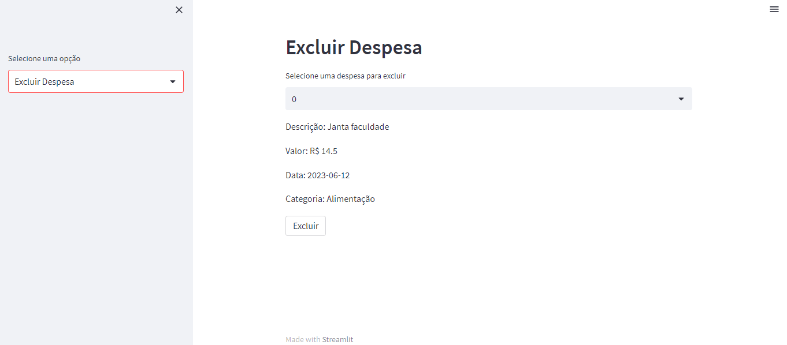

# Sistema de Despesas Mensais

## Descrição do Projeto
O Sistema de Despesas Mensais é uma aplicação simples desenvolvida utilizando o Streamlit. Ele permite aos usuários registrar, editar, excluir e visualizar despesas mensais. Os dados são salvos localmente em um arquivo CSV.

## Como Executar

1. Certifique-se de ter o Python 3.7 ou superior instalado.

2. Clone o repositório para o seu ambiente local.
```
git clone git@github.com:2wo-Labs/crud-sistema-gastos-mensais.git
```

3. Instale as dependências usando o comando:
```
pip install -r requirements.txt
```

4. Execute o aplicativo utilizando o comando:
```
streamlit run app.py
```

5. O aplicativo será aberto em seu navegador padrão. Você pode interagir com as diferentes funcionalidades do sistema.


## Funcionalidades

- **Adicionar despesas**: Os usuários podem inserir os detalhes de uma nova despesa, como descrição, valor, data e categoria. Os dados são salvos no arquivo CSV local.

- **Editar despesas**: Os usuários podem selecionar uma despesa existente da lista e fazer alterações nos detalhes, como descrição, valor, data ou categoria. As alterações são atualizadas no arquivo CSV.

- **Excluir despesas**: Os usuários podem selecionar uma despesa da lista e removê-la. A despesa é removida do arquivo CSV.

- **Visualizar despesas**: Os usuários podem filtrar e visualizar as despesas por mês ou categoria. O sistema exibe os dados correspondentes na interface do Streamlit.


## Exemplos de Uso

Aqui estão alguns exemplos de como usar o Sistema de Gastos Mensais:

1. **Adicionar Despesa**:
   - Preencha os detalhes da despesa, como descrição, valor, data e categoria, na seção "Adicionar Despesa".
   - Clique no botão "Adicionar".
   - A despesa será salva e exibida na lista de despesas.

2. **Editar Despesa**:
   - Selecione uma despesa existente na lista de despesas.
   - Faça as alterações necessárias nos campos de descrição, valor, data ou categoria na seção "Editar Despesa".
   - Clique no botão "Salvar".
   - As alterações serão atualizadas e a despesa será exibida com os novos detalhes.

3. **Excluir Despesa**:
   - Selecione uma despesa existente na lista de despesas.
   - Verifique os detalhes da despesa.
   - Clique no botão "Excluir".
   - A despesa será removida da lista.

4. **Visualizar Despesas**:
   - Utilize os filtros de mês e categoria na seção "Visualizar Despesas" para visualizar despesas específicas.
   - As despesas correspondentes serão exibidas em forma de tabela.


## Screenshots

Aqui estão algumas capturas de tela do Sistema de Gastos Mensais:

**Adicionar Despesa**


Na página de adição de despesas, você pode inserir os detalhes da despesa, como descrição, valor, data e categoria. Basta preencher os campos e clicar em "Adicionar" para salvar a despesa.

**Editar Despesa**


Na página de edição de despesas, você pode selecionar uma despesa existente da lista e fazer alterações nos detalhes. Os campos de descrição, valor, data e categoria são editáveis. Clique em "Salvar" para aplicar as alterações.

**Excluir Despesa**



Na página de exclusão de despesas, você pode selecionar uma despesa da lista e visualizar os detalhes. Para excluir a despesa selecionada, basta clicar em "Excluir".

**Visualizar Despesas**


Na página de visualização de despesas, você pode filtrar as despesas por mês e categoria. Os resultados filtrados são exibidos em uma tabela abaixo. Você pode usar essa página para acompanhar suas despesas mensais.


## Dependências

O sistema depende das seguintes bibliotecas Python:

- pandas
- chardet
- streamlit

Você pode instalá-las manualmente ou usando o arquivo `requirements.txt` fornecido.

## Contribuição

Contribuições são bem-vindas! Sinta-se à vontade para abrir uma issue ou enviar um pull request com melhorias ou correções.

## Licença

Este projeto está licenciado sob a [MIT License](LICENSE).
